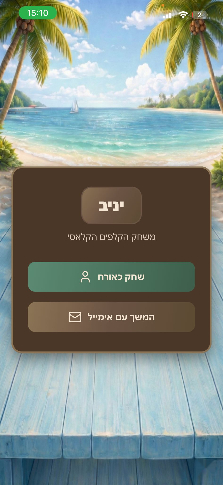
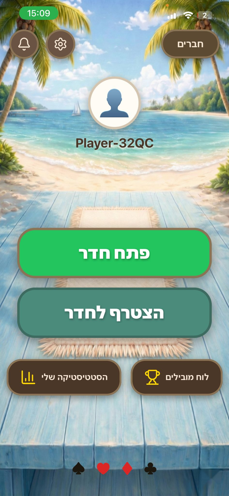
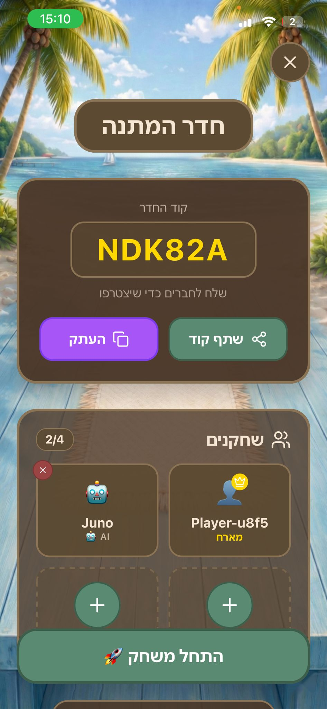
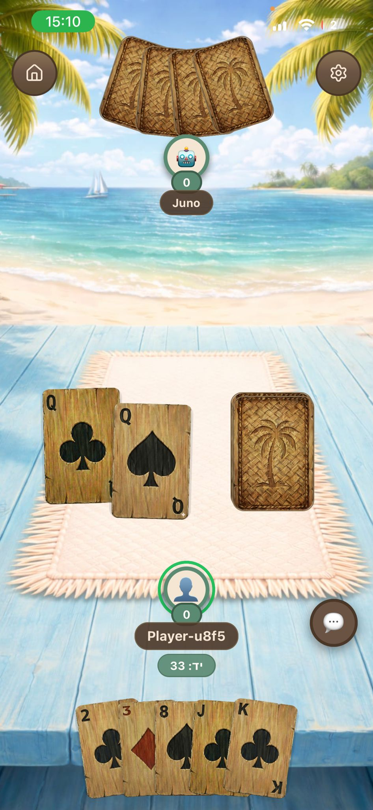
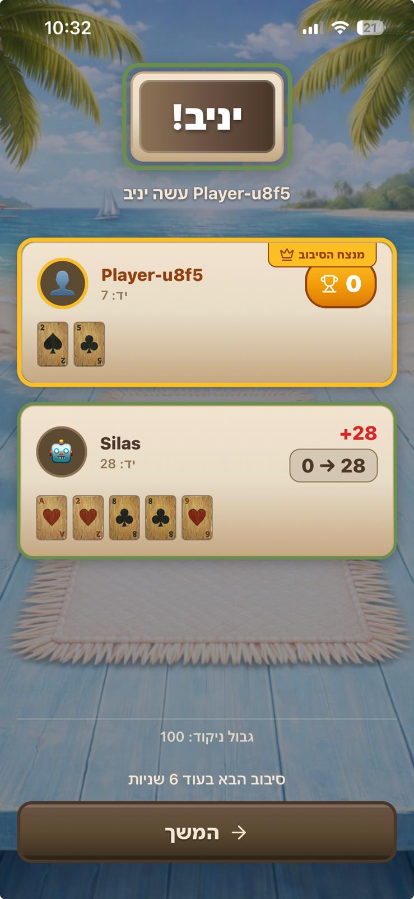

# Yaniv Card Game

A mobile implementation of the classic Israeli card game. Supports local play against AI and real-time online multiplayer via private rooms.


## Screenshots

<p align="center">
  
  
  
</p>

<p align="center">
  
  
</p>

## Tech stack

- **Frontend:** React Native, Expo, Expo Router, TypeScript
- **Backend:** Node.js, Express, Socket.io (deployed on [Fly.io](https://fly.io))
- **Auth & data:** Firebase Authentication + Firestore

## Features

- Online multiplayer via private room codes
- Offline play against AI opponents
- Sticking mechanic — short window to stick a matching card after drawing
- Assaf penalties, Joker substitutions, and card run/set validation
- In-game chat, friend invites, leaderboard, and match statistics

## Project structure

```
yaniv/
├── app/          # Screens and navigation (Expo Router)
├── context/      # Auth, language, and sound providers
├── lib/          # Firebase client, socket service, game sounds
└── server/       # Game server — rooms, rules, AI logic
```

## Running locally

### Prerequisites

- Node.js 18+
- Expo Go on your phone, or an iOS/Android emulator
- A Firebase project (see step 2)

### 1. Clone the repo

```bash
git clone https://github.com/Danvngr/yaniv-app-cardgame.git
cd yaniv-app-cardgame
```

### 2. Firebase setup

Create a project at [console.firebase.google.com](https://console.firebase.google.com) and enable:

- **Authentication** — Email/Password and Anonymous providers
- **Firestore** — friends, invites, leaderboard data

Copy your config into `app.json` under `expo.extra`:

```json
"extra": {
  "firebaseApiKey": "...",
  "firebaseAuthDomain": "...",
  "firebaseProjectId": "...",
  "firebaseStorageBucket": "...",
  "firebaseMessagingSenderId": "...",
  "firebaseAppId": "..."
}
```

> Values are read at runtime via `expo-constants`. Do not commit real API keys — use `app.config.js` + env vars, or keep secrets out of version control.

### 3. Run the game server

```bash
cd server
npm install
npm run dev
```

Server default: `http://localhost:3001`.

The app is wired to the production server (`yaniv-game-server.fly.dev`) in `lib/socketService.ts`. For local play, set:

```typescript
const SERVER_URL = 'http://localhost:3001';
```

(Use your machine’s LAN IP if testing from a physical device.)

### 4. Run the client

```bash
cd ..
npm install
npx expo start
```

Scan the QR code with Expo Go, or press `a` / `i` for Android / iOS emulator.

## Deploying the server

Room state lives in memory — run **one** Fly.io machine so all clients share the same process.

```bash
cd server
fly deploy
fly scale count 1
```

Point `SERVER_URL` in `lib/socketService.ts` at your Fly.io URL after deploy.

---

Daniel — CS Student
